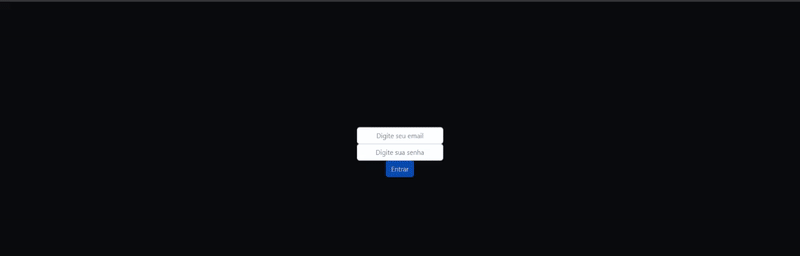

    

<h1 align="center">Carteira Digital</h1>
<p align="center">Uma carteira digital que tem a capacidade de fazer o controle de gastos da pessoa usuária com as cotações das moedas no momento atual.</p>
<p align="center"> 
  
 </p>

# Sumário

• [Sobre o Projeto](#-sobre-o-projeto)

• [Tecnologias utilizadas no desenvolvimento do projeto](#-tecnologias-utilizadas-no-desenvolvimento-do-projeto)

- [Como executar o projeto](#-como-executar-o-projeto)
  - [Remotamente](#remotamente)
  - [Localmente](#localmente)

### 💻 Sobre o Projeto

<p> Foi utilizado a API de Cotação de Moedas da Awesome API, que entrega os valores da moeda no momento atual, que serão utilizadas para fazer a conversão em BRL.</p>

### 🛠 Tecnologias utilizadas no desenvolvimento do projeto

- **[React](https://github.com/facebook/react)**
- **[React Router Dom](https://github.com/ReactTraining/react-router/tree/master/packages/react-router-dom)**
- **[Redux](https://github.com/facebook/react)**
- **[Jest](https://github.com/facebook/jest#-delightful-javascript-testing)**
- **[Bootstrap](https://getbootstrap.com/)**

  > Veja o arquivo [package.json](https://github.com/andremarquezz/ProjetoWallet/blob/Wallet/package.json)

# 🚀 Como executar o projeto

### Remotamente

_Copie a URL abaixo e cole no seu navegador_

```jsx
https://projetowallet.vercel.app/
```

### Localmente

_Pré-requisitos_

Antes de começar, você vai precisar ter instalado em sua máquina as seguintes ferramentas:
[Git](https://git-scm.com), [Node.js](https://nodejs.org/en/).
Além disto é bom ter um editor para trabalhar com o código como [VSCode](https://code.visualstudio.com/)

_1- Clonar o repositorio_

```jsx
git@github.com:andremarquezz/ProjetoWallet.git
```

_2- Executar o comando abaixo no terminal, dentro da pasta do projeto._

```jsx
npm install
```

_3- Executar o comando abaixo no terminal, dentro da pasta do projeto._

```jsx
npm start
```

# Links Úteis

[API Awesome](https://economia.awesomeapi.com.br/json/all)
